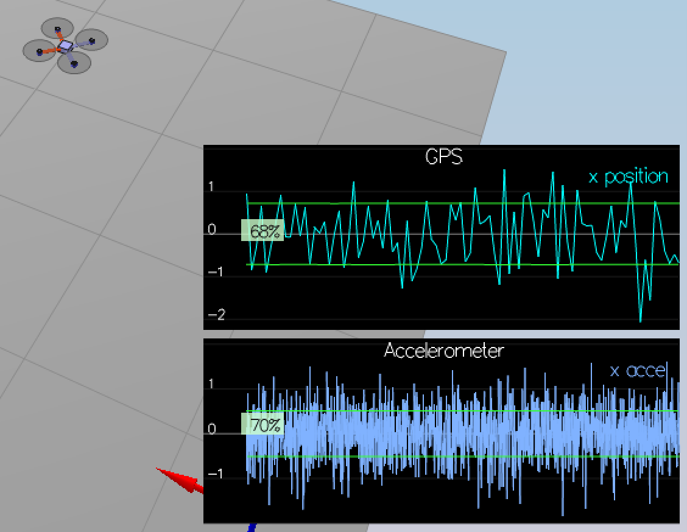
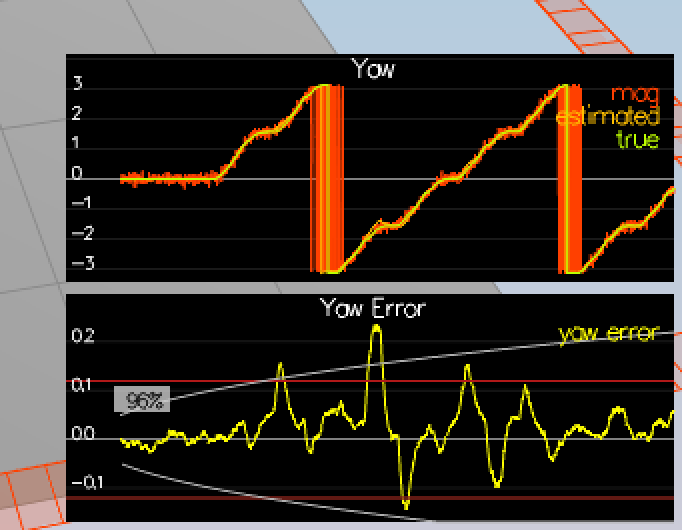
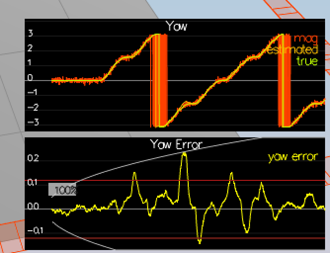
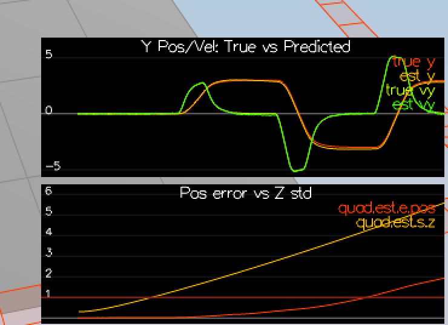
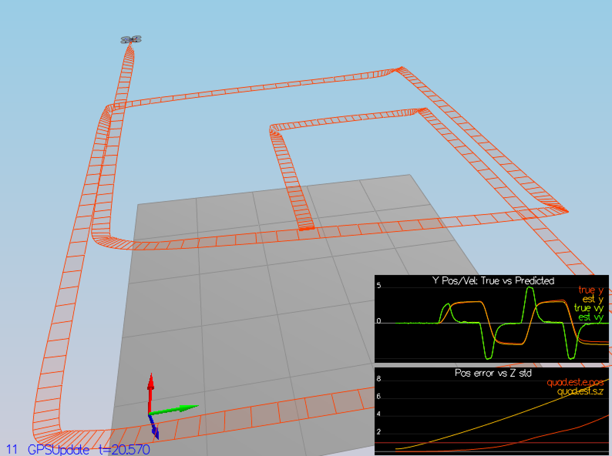
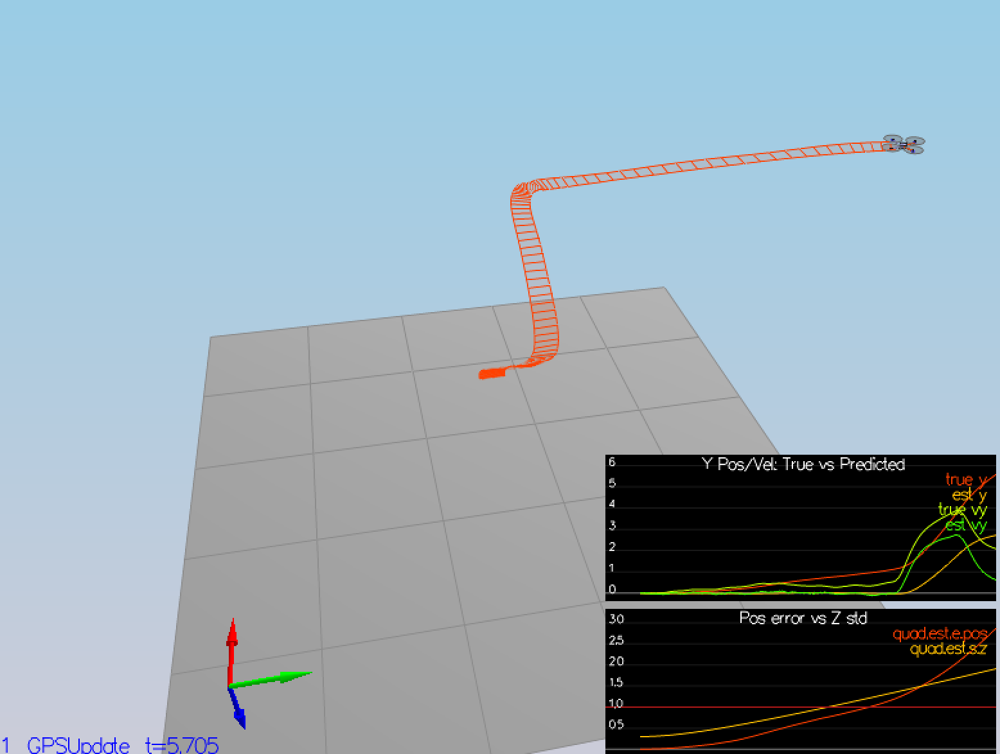

# FCND-Estimation-CPP
Udacity Flying Car - Estimation Assignment

Date: 01 Oct 2018


# Implement Estimator


## Determine the standard deviation of the measurement noise of both GPS X data and Accelerometer X data

Requirements: The calculated standard deviation should correctly capture ~68% of the sensor measurements. Your writeup should describe the method used for determining the standard deviation given the simulated sensor measurements.

Following the instructions, I run the scenario 06_NoisySensors to collect sensor data into:

- config/log/Graph1.txt (GPS X data)
- config/log/Graph2.txt (Accelerometer X data)

Later, I used a few lines python code to read the log files and calculate the standard deviation. The python code follows below: 

  ```python
  import numpy as np
  import matplotlib.pyplot as plt

  gps_data = np.loadtxt('./config/log/Graph1.txt',delimiter=',',dtype='Float64',skiprows=1)[:,1]
  acc_data = np.loadtxt('./config/log/Graph2.txt',delimiter=',',dtype='Float64',skiprows=1)[:,1]

  print('GPS Std: {}'.format(np.std(gps_data)))
  print('IMU Std: {}'.format(np.std(acc_data)))
  ```
  
The following values were calculated: 
  
- GPS Std: 0.717748979625617
- IMU Std: 0.5094537635047416

And consequesntly, I added the following values to the file config/6_Sensornoise.txt:

- MeasuredStdDev_GPSPosXY = 0.717
- MeasuredStdDev_AccelXY = .51

The result after tuning the above values is shown in the pictiure below. 



## Implement a better rate gyro attitude integration scheme in the UpdateFromIMU() function

Requirements: The improved integration scheme should result in an attitude estimator of < 0.1 rad for each of the Euler angles for a duration of at least 3 seconds during the simulation. The integration scheme should use quaternions to improve performance over the current simple integration scheme.


I decided to use the non-linear approach using the Quaternion<float> class that was provided. Below is the code that I added to UpdateFromIMU():

  ```c++
    Quaternion<float> quat = Quaternion<float>::FromEuler123_RPY(rollEst, pitchEst, ekfState(6)); //Convert Euler angles to Quartenion
    quat.IntegrateBodyRate(gyro, dtIMU); //gyro value is pqr.
    
    float predictedPitch = quat.Pitch();
    float predictedRoll = quat.Roll();
    ekfState(6) = quat.Yaw();
    
    // normalize yaw to -pi .. pi
    if (ekfState(6) > F_PI) ekfState(6) -= 2.f*F_PI;
    if (ekfState(6) < -F_PI) ekfState(6) += 2.f*F_PI;
  ```

The result was the following: 
- PASS: ABS(Quad.Est.E.MaxEuler) was less than 0.100000 for at least 3.000000 seconds

")


## Implement all of the elements of the prediction step for the estimator

Requirements: The prediction step should include the state update element (PredictState() function), a correct calculation of the Rgb prime matrix, and a proper update of the state covariance. The acceleration should be accounted for as a command in the calculation of gPrime. The covariance update should follow the classic EKF update equation.


#### PredictState()

Before implementing the funciton: 

")

```c++
    predictedState(0) = curState(0) + curState(3) * dt; //x position
    predictedState(1) = curState(1) + curState(4) * dt; //y position
    predictedState(2) = curState(2) + curState(5) * dt; //z position
    
    V3F accelI = attitude.Rotate_BtoI(accel); //rotate "accel" vector from body frame to inertial frame
    
    predictedState(3) = curState(3) + dt * accelI.x; //x_dot velocity
    predictedState(4) = curState(4) + dt * accelI.y; //z_dot velocity
    predictedState(5) = curState(5) + dt * accelI.z - dt * CONST_GRAVITY; //z_dot velocity
```

Below screenshot shows the result after implementing the PredictState() function.

")

#### GetRbgPrime()

Pre-implementation of GetRbgPrime(): 

")

Added the following to GetRbgPrime(): 

```c++
    float cos_theta = cos(pitch);
    float sin_theta = sin(pitch);
    float cos_phi = cos(roll);
    float sin_phi = sin(roll);
    float sin_psi = sin(yaw);
    float cos_psi = cos(yaw);
    
    RbgPrime(0,0) = -cos_theta * sin_psi;
    RbgPrime(0,1) = -sin_phi * sin_theta * sin_psi - cos_theta * cos_psi;
    RbgPrime(0,2) = -cos_phi * sin_theta * sin_psi + sin_phi   * cos_psi;
    
    RbgPrime(1,0) = cos_theta * cos_psi;
    RbgPrime(1,1) = sin_phi  * sin_theta * cos_psi - cos_phi * sin_psi;
    RbgPrime(1,2) = cos_phi  * sin_theta * cos_psi + sin_phi * sin_psi;
```

And added the following step to Predict() which is the Jacobian and Rbg' to predict the state covariance forward:

```c++
    gPrime(0,3) = dt;
    gPrime(1,4) = dt;
    gPrime(2,5) = dt;
    
    gPrime(3, 6) = (RbgPrime(0) * accel).sum() * dt;
    gPrime(4, 6) = (RbgPrime(1) * accel).sum() * dt;
    gPrime(5, 6) = (RbgPrime(2) * accel).sum() * dt;
    
    ekfCov = gPrime * ekfCov * gPrime.transpose() + Q;
```

After Implementation of GetRbgPrime() and Predict():

I tuned the following parameters: 

- QPosXYStd = 0.04
- QVelXYStd = 0.3

And the result is: 

 and tuning the parameters")


## Implement the magnetometer update

Requirements: The update should properly include the magnetometer data into the state. Note that the solution should make sure to correctly measure the angle error between the current state and the magnetometer value (error should be the short way around, not the long way).

I run 10_MagUpdate before impementing the magne. Before tuning the QYawStd parameter, the following was the result: 



Then I tuned QYawStd in QuadEstimatorEKF.txt to 0.8 and got the following: 



I implemented the following code: 

```c++
    hPrime(6) = 1; //Since its linear, the derivative is [0, 0, 0, 0, 0, 0, 1]
    
    zFromX(0) = ekfState(6);
    float diff = magYaw - ekfState(6);
    
    if (diff > F_PI)
        zFromX(0) += 2.f*F_PI;
    else if (diff < -F_PI)
        zFromX(0) -= 2.f*F_PI;

```

Also I retuned QYawStd again to 0.2 and the result is the following: 

  PASS: ABS(Quad.Est.E.Yaw-0.000000) was less than Quad.Est.S.Yaw for 79% of the time


## Implement the GPS update

Requirements: The estimator should correctly incorporate the GPS information to update the current state estimate.

First I run the simulator with an ideal estimator and an ideal IMU and got the following result: 



Step 2, i changed the value of Quad.UseIdealEstimator to 0 and got the following effect: 



Commented out the follwoing in config/11_GPSUpdate.txt and the result was as below: 

#SimIMU.AccelStd = 0,0,0
#SimIMU.GyroStd = 0,0,0




# Flight Evaluation

## Meet the performance criteria of each step

Requirements: For each step of the project, the final estimator should be able to successfully meet the performance criteria with the controller provided. The estimator's parameters should be properly adjusted to satisfy each of the performance criteria elements.


## De-tune your controller to successfully fly the final desired box trajectory with your estimator and realistic sensors

Requirements: The controller developed in the previous project should be de-tuned to successfully meet the performance criteria of the final scenario (<1m error for entire box flight).


